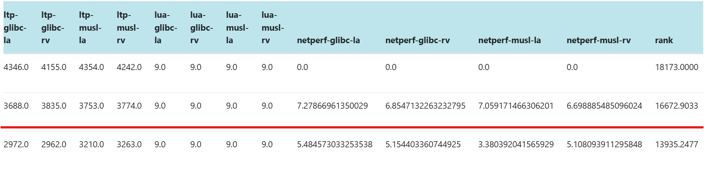

## 目录

- [🚀 RocketOS](#-rocketos)
- [决赛一阶段成绩](#决赛一阶段成绩)
- [RocketOS 内核设计](#rocketos-内核设计)
- [核心功能实现](#核心功能实现)
- [RocketOS核心竞争优势](#rocketos核心竞争优势)
- [构建、启动与调试](#构建启动与调试)
- [项目参与人员](#项目参与人员)
- [参考项目](#参考项目)
- [相关链接](#相关链接)
---


# 🚀 RocketOS
RocketOS 是一款采用 Rust 语言开发的现代化宏内核操作系统，支持 **RISC-V** 和 **LoongArch** 架构, 同时适配了星光二代和2k1000两块开发板。该系统采用同步栈式设计架构，集成了完整的中断处理机制、进程管理系统、内存管理模块、文件系统、 eBPF模块以及网络协议栈等核心组件，通过系统调用接口为用户程序提供高效可靠的服务支持。

# 决赛一阶段成绩
截至2025-8-17日点，RocketOS通过除ltp外全部测试点，在实时排行榜中位置于第二名，总分共计16672.9033



# RocketOS 内核设计


# 核心功能实现
- **内存管理：** 提供高效的内存分配和虚拟内存管理机制，采用写时复制（Copy-on-Write）与懒分配（Lazy Allocation）的优化策略，最大化内存资源利用效率，确保系统内存访问的高性能表现
- **文件系统：** 支持多种文件操作和目录管理功能，全面兼容ext4、FAT32等多种主流文件系统格式，构建了完善的VFS（虚拟文件系统）抽象层，提供统一的文件系统接口，实现跨文件系统的透明访问和高效管理
- **信号机制：** 支持进程间的信号传递和处理，提供毫秒级实时信号响应和异步事件通知功能，严格遵循POSIX标准规范，保障进程间通信的高可靠性和兼容性
- **进程管理：** 支持多任务调度和进程间通信，采用FIFO（先进先出）调度算法，在保证系统实时性的同时提供卓越的可靠性，确保任务执行的确定性和可预测性
- **网络协议栈：** 支持完整的TCP/IP协议族和基础网络通信功能，实现标准化的网络分层架构，提供高性能套接字接口和优化的网络数据包处理机制，确保网络数据传输的稳定性和高效性
- **架构适配：** 支持RISC-V与LoongArch两种主流处理器架构，采用统一的核心源代码框架实现系统核心功能，通过精细化条件编译机制进行架构特定的局部优化调整，确保跨平台的高效移植和性能一致性
- **eBPF：** 提供轻量级的可编程内核扩展机制，支持通过 bpf() 系统调用加载并运行用户定义的 eBPF 程序。系统实现了基础的 eBPF 指令集解释器与 map 数据结构，能够对系统调用和内核事件进行灵活监控和处理，为性能调优、安全防护和内核可观测性提供一定支持。
- **硬件驱动**: 
  - 网卡驱动： 系统实现了对 VisionFive2 网卡的完整驱动支持，能够在用户态正常运行 curl、git 等多种网络应用。驱动设计秉持低耦合度原则，可与多款内核高效适配，并已完全开源。同时，系统借助 la2000_driver 依赖库支持龙芯 2K1000 网卡，针对该依赖库优化了描述符分配机制，避免由于地址未对齐或错误地址导致的总线卡死问题，进一步提升了网络通信的稳定性。
  - SD 卡驱动： 为加速存储功能支持，系统在现有开源 SD 驱动库的基础上进行适配与移植，并结合内核特性，确保在 S 态下稳定访问硬件。该驱动已在 LoongArch 与 RISC-V 等架构上验证，能够稳定支持 SD 卡初始化与数据传输，保障系统的外部存储扩展能力。

# RocketOS核心竞争优势
***注意： 性能测试结果与测评环境及服务器负载相关，以下数据仅供参考。***

**1. 系统兼容性与稳定性**

通过较为充分的LTP测例验证，包括功能性测试、边界条件测试和异常处理测试，RocketOS高度符合POSIX标准，确保与Linux应用程序的良好兼容性。系统具备健壮的错误处理机制和优秀的资源管理能力，为应用运行提供可靠保障。

**2. 文件I/O性能领先**

在iozone基准测试获得总分第一，得益于页缓存机制有效减少磁盘访问次数，显著提升文件系统吞吐量。同时，优化的存储驱动与硬件深度协同，实现了卓越的I/O性能表现。

**3.综合性能卓越**

在lmbench综合性能测试中夺得总分第一，netperf网络性能测试中得分第一， libcbench测试中位居前列，所有性能测试总分第一，充分体现了系统底层的全方位精细优化成果。

关键优化包括：execve时的按需加载机制和只读段页缓存共享、匿名映射区域的预测分配策略、基于架构保留页表位的高效共享/私有映射实现，以及采用哈希桶管理的futex快速锁机制，有效分散热点并提升并发性能。

**4.实时调度性能突出**

在cyclictest实时性能测试中斩获总分第一，展现了极低的调度延迟和高效的任务切换能力。采用同步调度机制结合任务上下文栈内保存技术，显著降低切换开销，为高并发和实时应用提供强有力支撑。

**5.可扩展性与生态兼容**

系统搭建了基本的eBPF框架, 为系统功能拓展和安全增强提供了灵活的执行环境，支持在不修改内核源码的前提下加载和运行用户定义程序。该机制为网络过滤、性能分析与系统监控等场景提供了强大的可扩展能力。同时，系统已成功支持 Vim、Python、GNU Coreutils、Git 等常见工具链与应用软件，展现出与 Linux 应用生态的高度兼容性与实用性。

**6. 调试与可观测性增强**

内核支持 backtrace 功能，能够在异常、崩溃或调试场景下完整回溯函数调用链，帮助开发者快速定位问题源头。该能力在内核错误处理、并发调试及复杂系统行为分析中具有重要价值，极大提升了系统的可观测性与可维护性，为持续优化与稳定运行提供了坚实保障。

<!-- omit in toc -->
## 项目主要结构

```
.
├── LICENSE
├── Makefile
├── README.md
├── bootloader
│   ├── opensbi-qemu
│   └── opensbi-qemu.bin
├── img
├── os
│   ├── src
│   │   ├── arch            # 架构适配
│   │   ├── boards          # 硬件适配
│   │   ├── bpf         	# eBPF相关实现
│   │   ├── drivers         # 设备驱动
│   │   ├── ext4            # ext4文件系统
│   │   ├── fat32           # fat32文件系统
│   │   ├── fs              # 虚拟文件系统
│   │   ├── futex           # 快速用户锁
│   │   ├── mm              # 内存管理
│   │   ├── net             # 网络模块
│   │   ├── sched           # 调度模块
│   │   ├── signal          # 信号机制
│   │   ├── syscall         # 系统调用
│   │   ├── task            # 任务控制
│   │   ├── time            # 时间模块
│   │   └── main.rs
│   └── vendor
├── scripts                 # 辅助脚本
└── user
    ├── src
    └── vendor
```

# 构建、启动与调试

<!-- omit in toc -->
## 构建方式

默认会同时构建 RISC-V 和 LoongArch 的内核和用户程序：

```bash
make kernel
```

构建过程将：

* 解压磁盘镜像
* 构建 RISC-V 和 LoongArch 架构的用户态与内核程序
* 生成 `kernel-rv` 和 `kernel-la` 两个内核镜像

<!-- omit in toc -->
## 启动系统

- 启动 RISC-V 模拟器：

```bash
make run-riscv
```

- 启动 LoongArch 模拟器：

```bash
make run-loongarch
```

<!-- omit in toc -->
## 调试支持
支持通过 gdb 进行调试：

```bash
make gdbserver    # 启动 QEMU 并开启 GDB 服务
make gdbclient    # 启动 GDB 客户端
```

<!-- omit in toc -->
## 清理构建文件

```bash
make clean
```

---

<!-- omit in toc -->
## 注意事项

* 需要安装 QEMU，且支持 `qemu-system-riscv64` 和 `qemu-system-loongarch64`。
* 使用了 `virtio` 设备和多磁盘模拟，请确保 QEMU 版本足够新。
* 需要支持交叉编译工具链，如 `riscv64-linux-musl-gcc` 与 `loongarch64-linux-musl-gcc`。

# 项目参与人员
**李昕昊：** 内存管理、文件系统、架构适配、eBPF框架

**翁浩男：** 进程管理、信号机制、多核调度

**沈翃宇：** 网络模块、开发板适配、驱动开发

**指导教师：** 刘国军


# 参考项目

[linux](https://github.com/torvalds/linux)  ： RocketOS 中内存管理、文件系统、eBPF等多个内核模块设计的核心参考基准，符合主流内核架构设计理念。

[Phoenix](https://github.com/ChenRuiwei/Phoenix) ：提供任务调度与信号机制的设计思路参考

[IMPACT](https://gitlab.eduxiji.net/educg-group-26011-2376549/T202410699992496-312) ：架构适配方面的参考项目，针对 LoongArch 架构的适配工作具有启发性。

[MinotaurOS](https://gitlab.eduxiji.net/educg-group-22026-2376550/T202410213992712-1533) ：参考其文档撰写风格和结构组织方式

[Starry](https://github.com/Starry-OS)，[ RT-Thread]( https://github.com/RT-Thread/rt-thread) ：网络模块的实现参考，具备基础的网络协议与驱动集成。

[dw_sd](https://github.com/QIUZHILEI/dw_sd): 针对 StarFive JH7110 平台的 SD/MMC/SDIO 控制器实现参考，涵盖命令序列与卡初始化（CMD0–CMD3 等）、时钟/总线宽度与电压切换、FIFO/DMA 传输路径与中断处理、速度模式切换（HS/DDR 等）及超时与错误恢复策略，为 RocketOS 在 RISC-V 平台的块设备框架对接提供直接借鉴。

[ls2k1000la_driver](https://github.com/Tikifire/ls2k1000la_driver) : 面向 Loongson 2K1000LA（兼具 LA2000 同源控制器族特性）的 SD/eMMC 控制器驱动参考，给出寄存器位定义与控制流程、PIO 与 DMA 数据通道、分区识别与多块读写、异常路径与重试机制的完整实现思路，对 RocketOS 在 LoongArch 平台的磁盘 I/O 子系统适配与稳定性优化具有实操价值。

# 相关链接

演示视频：https://pan.baidu.com/s/1pJmtZQusYHB0dk91_3ERbg 提取码: fvff

设计文档：[RocketOS决赛文档](./docs/RocketOS决赛文档.pdf)

---

**欢迎学习和修改本项目，用于教学、研究和实验操作系统开发 🚀**

---

