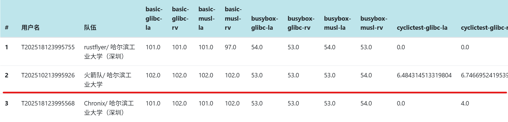

## 目录

- [🚀 RocketOS](#-rocketos)
- [初赛成绩](#初赛成绩)
- [RocketOS 内核整体设计](#rocketos-内核整体设计)
- [构建、启动与调试](#构建启动与调试)
- [项目参与人员](#项目参与人员)
- [相关链接](#相关链接)
- [参考项目](#参考项目)
---

# 🚀 RocketOS
RocketOS 是一款采用 Rust 语言开发的现代化宏内核操作系统，支持 **RISC-V** 和 **LoongArch** 架构。该系统从最小内核开始开发，采用同步栈式设计架构，集成了完整的中断处理机制、进程管理系统、内存管理模块、文件系统以及网络协议栈等核心组件，通过系统调用接口为用户程序提供高效可靠的服务支持

# 初赛成绩
截至2025-6-30日20点，RocketOS通过除ltp外全部测试点，在实时排行榜中处于榜首，总分共计11720.05



# RocketOS 内核设计


## **核心功能实现：**
- **内存管理：** 提供高效的内存分配和虚拟内存管理机制，采用写时复制（Copy-on-Write）与懒分配（Lazy Allocation）的优化策略，最大化内存资源利用效率，确保系统内存访问的高性能表现
- **文件系统：** 支持多种文件操作和目录管理功能，全面兼容ext4、FAT32等多种主流文件系统格式，构建了完善的VFS（虚拟文件系统）抽象层，提供统一的文件系统接口，实现跨文件系统的透明访问和高效管理
- **信号机制：** 支持进程间的信号传递和处理，提供毫秒级实时信号响应和异步事件通知功能，严格遵循POSIX标准规范，保障进程间通信的高可靠性和兼容性
- **进程管理：** 支持多任务调度和进程间通信，采用FIFO（先进先出）调度算法，在保证系统实时性的同时提供卓越的可靠性，确保任务执行的确定性和可预测性
- **网络协议栈：** 支持完整的TCP/IP协议族和基础网络通信功能，实现标准化的网络分层架构，提供高性能套接字接口和优化的网络数据包处理机制，确保网络数据传输的稳定性和高效性
- **架构适配：** 支持RISC-V与LoongArch两种主流处理器架构，采用统一的核心源代码框架实现系统核心功能，通过精细化条件编译机制进行架构特定的局部优化调整，确保跨平台的高效移植和性能一致性

## RocketOS核心竞争优势
***注意： 性能测试结果与测评环境及服务器负载相关，以下数据仅供参考。***

**1. 系统兼容性与稳定性**

通过较为充分的LTP测例验证，包括功能性测试、边界条件测试和异常处理测试，RocketOS高度符合POSIX标准，确保与Linux应用程序的良好兼容性。系统具备健壮的错误处理机制和优秀的资源管理能力，为应用运行提供可靠保障。

**2. 文件I/O性能领先**

在iozone基准测试中拥有优异成绩，得益于智能页缓存机制有效减少磁盘访问次数，显著提升文件系统吞吐量。同时，优化的存储驱动与硬件深度协同，实现了卓越的I/O性能表现。

**3.综合性能卓越**

在lmbench综合性能测试中夺得总分第一，libcbench测试中位居前列，所有性能测试总分第一，充分体现了系统底层的全方位精细优化成果。

关键优化包括：execve时的按需加载机制和只读段页缓存共享、匿名映射区域的预测分配策略、基于架构保留页表位的高效共享/私有映射实现，以及采用哈希桶管理的futex快速锁机制，有效分散热点并提升并发性能。

**4.实时调度性能突出**

在cyclictest实时性能测试中斩获总分第一，展现了极低的调度延迟和高效的任务切换能力。采用同步调度机制结合任务上下文栈内保存技术，显著降低切换开销，为高并发和实时应用提供强有力支撑。
  
## 项目主要结构

```
.
├── LICENSE
├── Makefile
├── README.md
├── bootloader
│   ├── opensbi-qemu
│   └── opensbi-qemu.bin
├── img
├── os
│   ├── src
│   │   ├── arch            # 架构适配
│   │   ├── drivers         # 设备驱动
│   │   ├── ext4            # ext4文件系统
│   │   ├── fat32           # fat32文件系统
│   │   ├── fs              # 虚拟文件系统
│   │   ├── futex           # 快速用户锁
│   │   ├── mm              # 内存管理
│   │   ├── net             # 网络模块
│   │   ├── signal          # 信号机制
│   │   ├── syscall         # 系统调用
│   │   ├── task            # 任务控制
│   │   ├── time            # 时间模块
│   │   └── main.rs
│   └── vendor
├── scripts                 # 辅助脚本
└── user
    ├── src
    └── vendor
```

# 构建、启动与调试

## 构建方式

默认会同时构建 RISC-V 和 LoongArch 的内核和用户程序：

```bash
make kernal
```

构建过程将：

* 解压磁盘镜像
* 构建 RISC-V 和 LoongArch 架构的用户态与内核程序
* 生成 `kernel-rv` 和 `kernel-la` 两个内核镜像

## 启动系统

- 启动 RISC-V 模拟器：

```bash
make run-riscv
```

- 启动 LoongArch 模拟器：

```bash
make run-loongarch
```

## 调试支持
支持通过 gdb 进行调试：

```bash
make gdbserver    # 启动 QEMU 并开启 GDB 服务
make gdbclient    # 启动 GDB 客户端
```

## 清理构建文件

```bash
make clean
```

---

## 注意事项

* 需要安装 QEMU，且支持 `qemu-system-riscv64` 和 `qemu-system-loongarch64`。
* 使用了 `virtio` 设备和多磁盘模拟，请确保 QEMU 版本足够新。
* 需要支持交叉编译工具链，如 `riscv64-linux-musl-gcc` 与 `loongarch64-linux-musl-gcc`。

## 项目参与人员
**李昕昊（队长）：** 内存管理、文件系统、架构适配

**翁浩男：** 进程管理、信号机制

**沈翃宇：** 网络模块

**指导教师：** 刘国军

# 相关链接

[初赛文档](./docs/RocketOS-初赛文档.pdf)

[演示ppt](./docs/RocketOS-演示ppt.pptx)

[演示视频](https://pan.baidu.com/s/10S-e04s-O_0hs0z_0eMZtQ )  提取码: vnfp

# 参考项目

[linux](https://github.com/torvalds/linux)  ： RocketOS 中内存管理、文件系统等多个内核模块设计的核心参考基准，符合主流内核架构设计理念。

[Phoenix](https://github.com/ChenRuiwei/Phoenix) ：提供任务调度与信号机制的设计思路参考

[IMPACT](https://gitlab.eduxiji.net/educg-group-26011-2376549/T202410699992496-312) ：架构适配方面的参考项目，针对 LoongArch 架构的适配工作具有启发性。

[MinotaurOS](https://gitlab.eduxiji.net/educg-group-22026-2376550/T202410213992712-1533) ：参考其文档撰写风格和结构组织方式

[Starry](https://github.com/Starry-OS) ：网络模块的实现参考，具备基础的网络协议与驱动集成。

---

欢迎学习和修改本项目，用于教学、研究和实验操作系统开发 🚀

---

